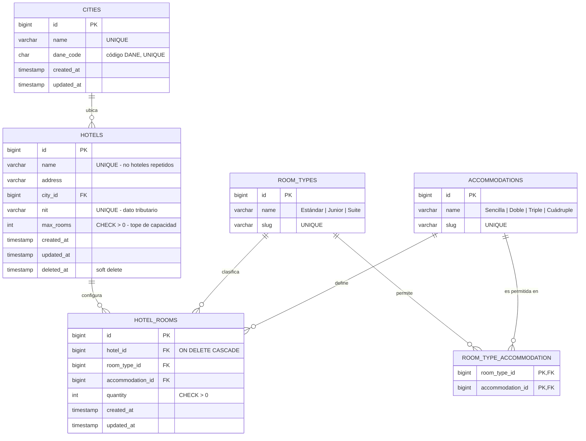

# Modelo de Datos

## 1. Diagrama Entidad-Relación

## 2. Reglas de negocio y dónde se hacen cumplir

La estrategia es de **doble barrera**: toda regla vive en la aplicación (con mensajes
de error legibles para el usuario) *y* en el motor de base de datos (como última
línea de defensa ante escrituras concurrentes o accesos externos).

| # | Regla (criterio de aceptación del PDF) | Barrera en aplicación | Barrera en base de datos |
|---|---|---|---|
| R1 | No deben existir hoteles repetidos | `StoreHotelRequest` → `unique:hotels,name` y `unique:hotels,nit` | `UNIQUE (name)`, `UNIQUE (nit)` |
| R2 | La acomodación debe corresponder al tipo de habitación | `AccommodationRuleResolver` (patrón Strategy) | Tabla catálogo `room_type_accommodation` + FK compuesta |
| R3 | No repetir tipo+acomodación en el mismo hotel | `UniqueRoomConfigurationRule` | `UNIQUE (hotel_id, room_type_id, accommodation_id)` |
| R4 | La suma de habitaciones no supera el máximo del hotel | `RoomCapacityValidator` (dentro de transacción con bloqueo) | `CHECK (quantity > 0)` + verificación transaccional |
| R5 | Los catálogos no tienen administración | Sin endpoints de escritura; sólo `GET /catalogs/*` | Poblados por seeders |

### R2 — Matriz de combinaciones válidas

Esta matriz es exactamente la del enunciado y se materializa en la tabla
`room_type_accommodation`, de modo que **agregar un tipo de habitación nuevo no
requiere desplegar código**: basta con un registro de catálogo.

|              | Sencilla | Doble | Triple | Cuádruple |
|--------------|:--------:|:-----:|:------:|:---------:|
| **Estándar** |    ✅    |  ✅   |   ❌   |     ❌    |
| **Junior**   |    ❌    |  ❌   |   ✅   |     ✅    |
| **Suite**    |    ✅    |  ✅   |   ✅   |     ❌    |

### R4 — Nota sobre concurrencia

La validación de capacidad es un *read-modify-write*: se lee la suma actual de
habitaciones, se compara con `max_rooms` y se escribe. Sin protección, dos
peticiones simultáneas podrían superar el tope entre la lectura y la escritura.
Por eso la asignación se ejecuta dentro de una transacción que toma un bloqueo
pesimista (`SELECT ... FOR UPDATE`) sobre la fila del hotel.

## 3. Índices

| Tabla | Índice | Motivo |
|---|---|---|
| `hotels` | `UNIQUE (name)` | R1 y búsqueda por nombre |
| `hotels` | `UNIQUE (nit)` | R1, identificador tributario |
| `hotels` | `INDEX (city_id)` | Filtrado del listado por ciudad |
| `hotels` | `INDEX (deleted_at)` | Excluir eliminados en cada consulta |
| `hotel_rooms` | `UNIQUE (hotel_id, room_type_id, accommodation_id)` | R3 |
| `hotel_rooms` | `INDEX (hotel_id)` | Carga de habitaciones del hotel |
| `room_type_accommodation` | `PRIMARY KEY (room_type_id, accommodation_id)` | R2 |

## 4. Decisiones de modelado

- **`max_rooms` en el hotel, no calculado.** Es un dato del negocio (capacidad
  física declarada del inmueble), no una suma. La suma de `hotel_rooms.quantity`
  es el *ocupado*; `max_rooms` es el *tope*. Confundirlos impediría registrar un
  hotel antes de configurar sus habitaciones.
- **Soft delete en `hotels`.** Un hotel eliminado conserva su historial de
  configuración para auditoría; `hotel_rooms` sí se elimina en cascada porque
  carece de sentido fuera de su hotel.
- **Catálogos con `slug`.** El código de negocio referencia `estandar`, `junior`,
  `suite` en lugar de IDs numéricos o nombres con tilde, lo que hace las reglas
  legibles y resistentes a cambios de redacción.
- **NIT como `varchar`.** Incluye guion de dígito de verificación (`12345678-9`)
  y puede tener ceros a la izquierda; nunca debe ser numérico.
