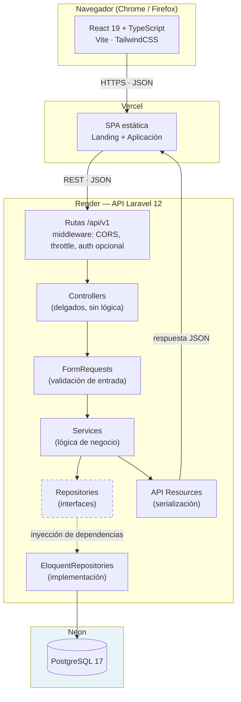
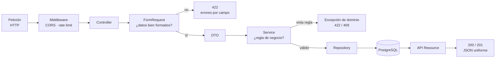
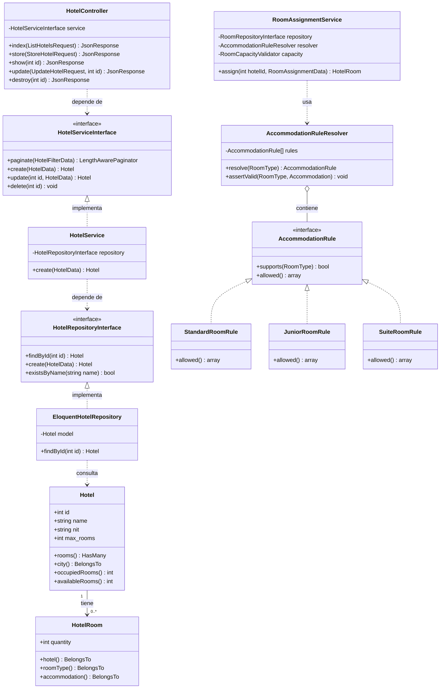
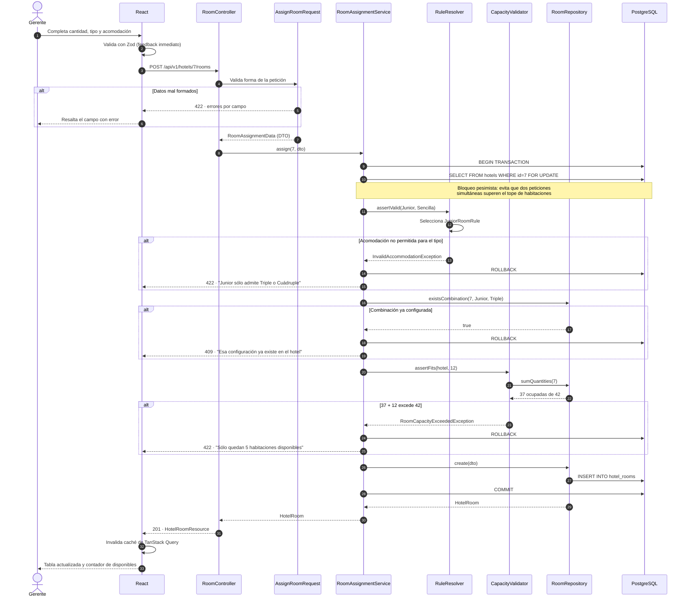

# Arquitectura del Sistema

## 1. Vista de componentes

El requisito del enunciado es que **back y front estén desacoplados**. Se cumple
literalmente: son dos aplicaciones independientes, con su propio ciclo de vida,
su propio despliegue y su propio pipeline de CI. El único contrato entre ellas es
HTTP/JSON.



La línea punteada entre `Repositories` y `EloquentRepositories` es el punto clave:
los servicios dependen de la **interfaz**, nunca de Eloquent. Es el principio de
Inversión de Dependencias hecho estructura, y es lo que permite testear la lógica
de negocio sin tocar la base de datos.

## 2. Flujo de una petición



Hay dos niveles de validación deliberadamente separados:

- **`FormRequest`** responde *"¿está bien formada la petición?"* — tipos, campos
  obligatorios, rangos, unicidad simple. No conoce el negocio.
- **`Service`** responde *"¿tiene sentido en el dominio?"* — la acomodación
  corresponde al tipo, la capacidad alcanza, la combinación no está repetida.

Mezclarlas sería cómodo pero rompería el principio de Responsabilidad Única y
haría imposible reutilizar las reglas fuera de una petición HTTP.

## 3. Diagrama de clases del dominio



## 4. Secuencia — asignar habitaciones a un hotel

Es la operación con más reglas del sistema, y por eso la que mejor ilustra la
arquitectura. El diagrama muestra los tres puntos donde la petición puede
rechazarse antes de escribir nada.



## 5. Estructura de carpetas del backend

```
backend/app/
├── Domain/                        # Núcleo: no depende de framework ni de HTTP
│   ├── Hotel/
│   │   ├── Data/                  # DTOs inmutables
│   │   ├── Exceptions/            # Excepciones de dominio
│   │   ├── Repositories/          # Interfaces (contratos)
│   │   ├── Rules/                 # Strategies de acomodación
│   │   └── Services/              # Lógica de negocio
│   └── Shared/
├── Http/                          # Frontera HTTP: delgada por diseño
│   ├── Controllers/Api/V1/
│   ├── Requests/                  # Validación de entrada
│   ├── Resources/                 # Serialización de salida
│   └── Middleware/
├── Infrastructure/                # Detalles reemplazables
│   └── Persistence/Eloquent/      # Implementación de los repositorios
├── Models/
└── Providers/                     # Enlace interfaz -> implementación
```

La regla que gobierna esta estructura: **las dependencias apuntan hacia adentro**.
`Domain` no importa nada de `Http` ni de `Infrastructure`. Se puede exponer el
mismo dominio por CLI, por cola de trabajos o por GraphQL sin tocar una línea de
lógica de negocio.
